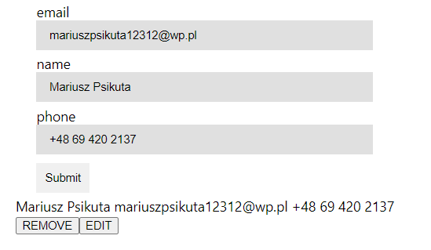
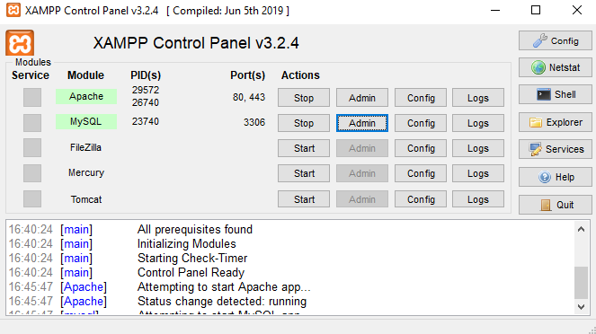
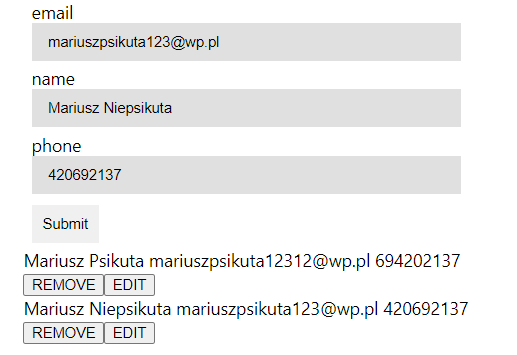
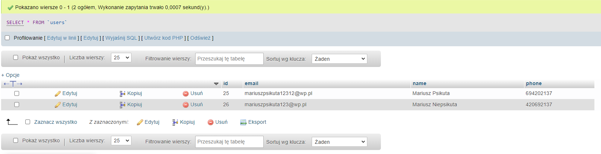
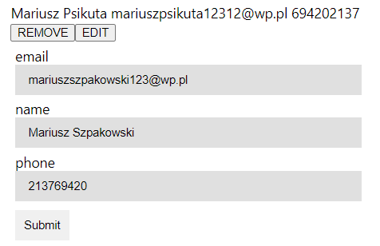
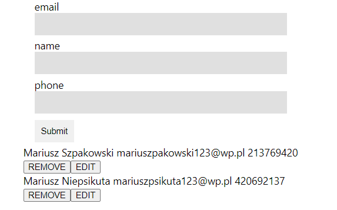
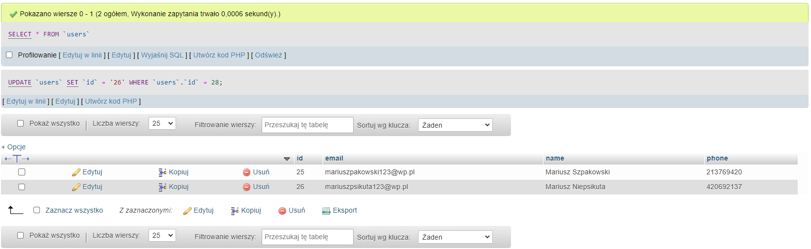

# Formularz

Projekt prostego formularza zbudowanego przy użyciu React, HTML, CSS i JavaScript.

#### O projekcie

Ten projekt jest aktualnie w fazie rozwoju. Formularz zbiera od użytkownika dane: adres e-mail, imię i numer telefonu. Dane te są wysyłane do bazy danych. Istnieje możliwość edycji wcześniej wysłanych danych.  

  

# Instrukcja instalacji i konfuguracji:

### Programy wymagane do otworzenia projektu
Aby wystartować projekt będziesz potrzebował zainstalowanych na twoim komputerze danych programów:   
NodeJS:  <a href="https://nodejs.org/en/download/">https://nodejs.org/en/download/</a>  
XAMPP:  <a href="https://www.apachefriends.org/pl/index.html">https://www.apachefriends.org/pl/index.html</a>  

W panelu XAMPP włącz moduł MySQL oraz Apache: 
 

Następnie utwórz bazę danych w o nazwię "users" oraz zaimportuj plik user.sql z folderu `react-form`.

### Dalsza konfiguracja
Sklonuj to repozytorium. Otwórz je w edytorze kodu źródłowego. W terminalu wpisz kolejno komendy:

`cd my-app` - przejście do folderu my-app  
`npm install` - zainstalowanie paczki node_modules  
`npm start` - uruchomienie servera 

Otwórz drugi terminal, a następnie wpisz poniższe komendy:

`cd server` - przejście do folderu server 
`npm install` - instalacja paczki node_modules w folderze server  
`node server.js` - uruchomienie pliku server.js   

Po wykonaniu wszystkich powyższych instrukcji server z formularzem powinien odpalić się samoistnie. W innym przypadku należy wpisać w przeglądarkę adres  `localhost:3000` 

# Działanie formularza

W formularz wpisujemy dane: adres e-mail, imię oraz numer telefonu. Po wpisaniu danych klikamy na przycisk `Submit` - następuje wysłanie wpisanych informacji do bazy danych.   
   
   
   
   
   
